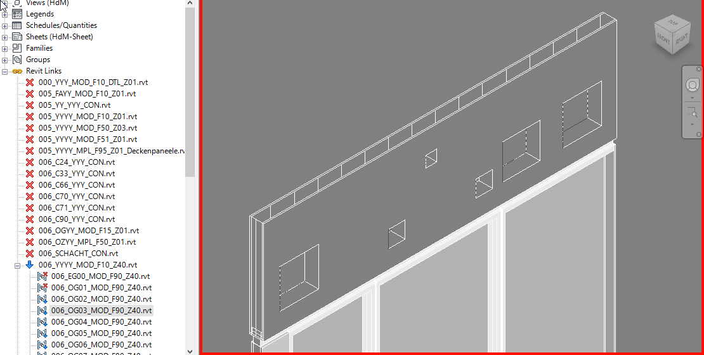

## script in action

#### script run without updates.


#### script run with few updates.


As explained in [README.md](README.md) there are three standard 
cases for voids, which are also demonstrated in the above GIF:

* **obsolete**: uncut and comment local void as obsolete
* **existing**: update local void data only, re-cut if needed
* **new void**: create, cut local void, timestamp & write data

#### obsolete
At the end of the script run the obsolete voids are reported by 
click-able id: 
```
ids of 2 obsolete voids:
31105378
28093167
```
Additionally they receive a obsolete note with time stamp in 
their comments parameter, so they are easy to find in a schedule.

#### existing
Most of the voids in the above script runs are existing voids with 
no external changes, so they are very quick to process.
Their regular output looks like this:
```
rvt id: 38070 , Durchbruch Nummer: FK059G03
bbox exist already, updating void data, checking for recut.
```
The ´rvt id´ lists the void id in the remote nested link model.
If the void needs to be re-cut the script would inform about it this way:
```
rvt id: 37998 , Durchbruch Nummer: F035G03
bbox exist already, updating void data, checking for recut.
-> existing void 31105578 cuts nothing currently!!
void: 31105578 not cutting: 19511851
recutting: 31105578
attempt to cut the following elements: walls_id: 19511851 with void_id: 31105578
```

#### new
If a new remote void is found a new local void is created, 
the output looks like this:
```
rvt id: 37998 , Durchbruch Nummer: F035G03
attempt to cut the following elements: walls_id: 19511851 with void_id: 31105593
```
The new local void receives its set of parameter values and a time stamp.

#### reporting
After the script run we see the reporting on the voids.
```
------------------------------------
new voids that did not cut anything:
[]
------------------------------------
0312 : voids_existing_already
0002 : voids_existing_cuts_nothing
0002 : voids_existing_obsolete
0001 : voids_existing_recut
0312 : voids_linked_found
```

New voids that are created but did not cut anything are explicitly 
listed as click-able id but also receive a note with time stamp in 
their comments parameter, so they are easy to find in a schedule.
