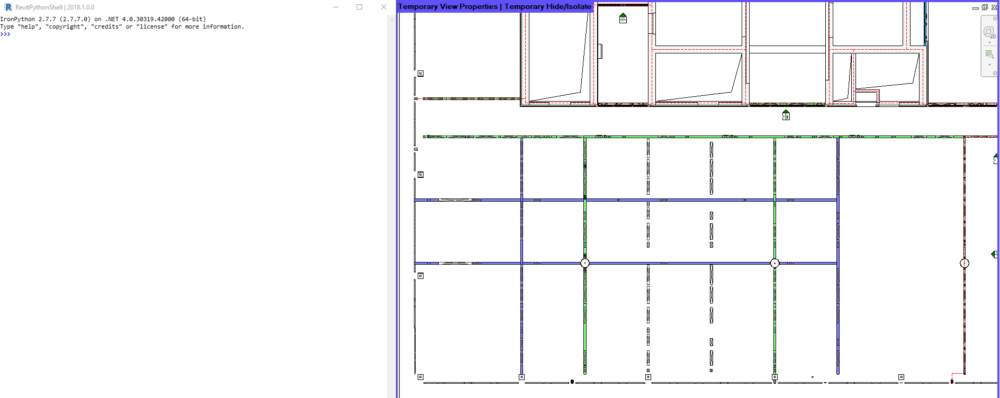
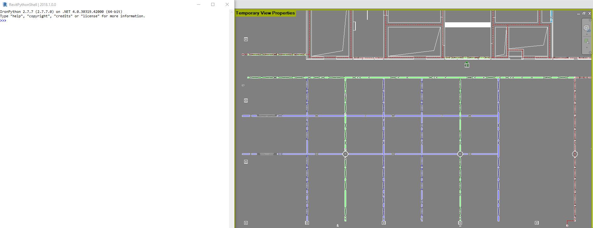
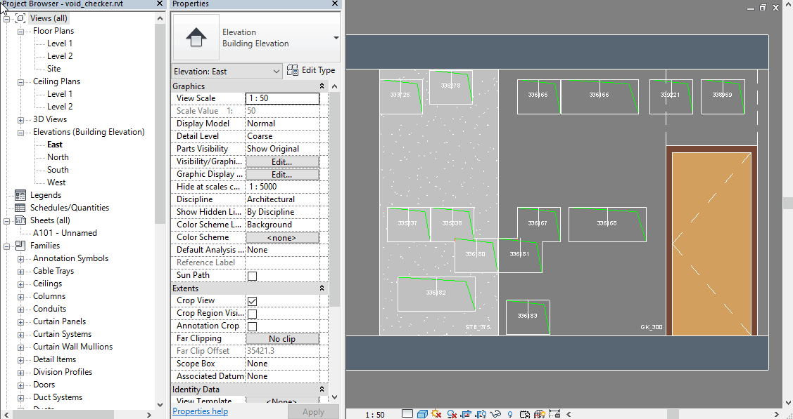

## scripted voids - additional benefits

Managing voids with script tools brings along a lot of benefits.
A non-exhaustive list:

* Reduction of time wasted on manual comparing and checking
* Reduction of human errors
* Data consistency
* Geometric consistency
* Reliable base for additional scripts - examples as shown below: 
    * [void tagging](#tagging) 
    * [void dimensioning](#dimensioning)
    * [void checking](#checking)

### tagging

Below we see a script run to tag the specific void family. 
Other than a regular tag-all, this script checks the height 
of the voids to be tagged and places the tag always with a 
pre-defined distance either above or below 
(respectively left or right) of a wall.
Different tag types can be chosen for specific tags
This leaves only graphical corrections needed to be done 
manually.

### dimensioning

Here we see scripted dimensioning. Similar to the script 
above, it takes into account the height of the void. 
The voids get dimensioned along the wall direction with a 
pre-defined distance grouped by the void height.
This leaves only the ends of the dimension strings to be 
attached to specific grids left needed to be done manually.

### checking

Many simple conditions af the countless voids in a model 
can be detected programmatically as shown in this demo:
* voids overlap
* voids being too close to each other
* voids being too close to a floor object
* voids cutting specific wall types (gypsum wall) being too wide
* voids cutting specific wall types (gypsum wall) being positioned above a projected door frame

